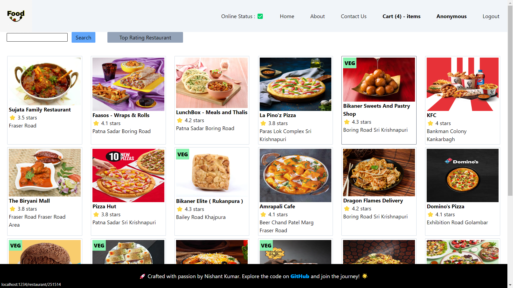

## Web Page Look Like :

# You Must To Know :

### Redux Toolkit :

- For Creating Store
  - `step1 : Install Redux toolkit and react-redux
`
  - `step2 : Buid store ,with help of Redux toolkit`
  - `step3 : Connect store with app by react-redux`
  - `step4 : Make slice`
  - `step4 : Subscribing to the store, we use "useSelector"`
  - `step4 : dispatch to the store, "useDispatch"`

### Basic Context in Details

  <ol>
    <li>
      <a href="#what-is-cdn">What is CDN ?</a>
    </li> 
    <li>
      <a href="#what-is-crossorigin">What is crossorigin ?</a>
    </li>
    <li>
      <a href="#what-is-npm">What is NPM?</a>
    </li>
    <li>
      <a href="#what-is-parcel-or-webpack-and-why-do-we-need-it">What is Parcel or Webpack and Why do we need it ?</a>
    </li>
    <li>
      <a href="#what-is-parcel-cache"> What is .parcel-cache ?</a>
    </li>
    <li>
      <a href="#what-is-npx">What is NPX ?</a>
    </li>
    <li>
      <a href="#what-is-difference-between-dependencies-vs-devDependencies">What is difference between dependencies vs devDependencies ?</a>
    </li>
    <li>
      <a href="#what-is-tree-shaking">What is Tree Shaking ?</a>
    </li>

  </ol>

 
 
  <pre>

Getting Started : To New Journey in ...

  </pre>

## What is CDN ?

CDN is Content Delivery Network in which `CDN spreads copies of content across multiple servers worldwide.when someone requests content ,the CDN delivers the content to them from the closest server.` so from which, it reduce load time ,more fast and smooth online experience.

## What is crossorigin ?

CORS it stands for Cross Origin Resource Sharing. `it is like as a set of rules of web browsers. it is a way to decide who is allowed to use resources like images  or data  on a website`. if website wants to share its stuff with another website on a different PORT or Location , CORS checks it is okay. if it's not allowed, the browser blocks it to keep things secure. so, CORS help control what different website can do with each other's stuff.

## What is NPM ?

`NPM is a package manager for the JavaScript programming language. NPM helps developers find, install, and manage libraries and packages (pieces of pre-written code) that can be used in their projects`. These packages can do various things, from adding fancy features to a website to helping with server-side tasks. NPM is a big part of the JavaScript ecosystem, making it easier for developers to share and use code, saving them lots of time and effort.

## What is Parcel or Webpack and Why do we need it ?

Parcel is a web application bundler. `In simpler terms, it's a tool that is used for package and bundle their web applications, including HTML, CSS, JavaScript, and other assets, so that they can be efficiently served to users' web browsers.`
Webpack is a powerful and highly configurable bundler suitable for complex projects where fine-tuned control over the build process is essential,its have well-established and large community. Parcel, on the other hand, excels in simplicity and ease of use, making it an excellent choice for quick setups and smaller to medium-sized projects, especially for developers who prefer a more automated and "zero-config" approach.
`For more : parceljs.org`

## What is .parcel-cache ?

The .parcel-cache directory is created by Parcel to `store cached data such as compiled JavaScript and CSS files, processed images, and other build-related artifacts.` This cache allows Parcel to quickly rebuild your project when you make changes without having to redo all the previous work, resulting in faster development builds.

## What is NPX ?

NPX is a command line tool that allows to run Node.js packages without installing it globally.

## What is difference between dependencies vs devDependencies ?

dependencies are essential things for project's functionality, while devDependencies are tools and resources used during development to help build and test the project.`dependencies is used for developement production time but devDependencies is used for only production time.`

## What is Tree Shaking ?

`Tree shaking is a technique that removes unused code from JavaScript modules. It is a form of dead code elimination that is performed during the build process.`
Tree shaking can significantly reduce the size of a JavaScript bundle, which can improve the performance of the application.
To use tree shaking, we need to use a JavaScript bundler that supports it, such as Webpack or Rollup or parcel.

<!-- 2. Babel `es6 management`
3. Parcel `it just compress`
   -parceljs.org

   - dev build
   - local server
   - HMR = Hot Module Replacement
   - File Watching Algorithm - written in c++
   - Caching - Faster Build

4. Bundler `Bundling`
5. Caret ^ `minor changes update`
6. Tildh ~ `major changes`
7. package.lock.json `lock the package.json file`
8. dev dependency `dev depend`
9. Module

`

npx parcel build index.html --prod
npx parcel index.html --dev

browserlist ==supprot specific

(<a href="#readme-top">back to top</a>)
 -->
